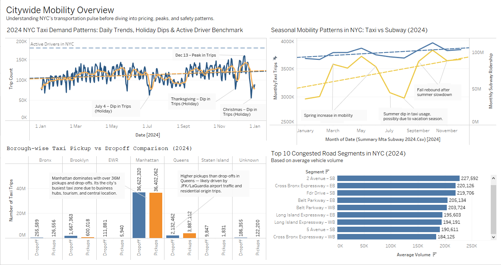
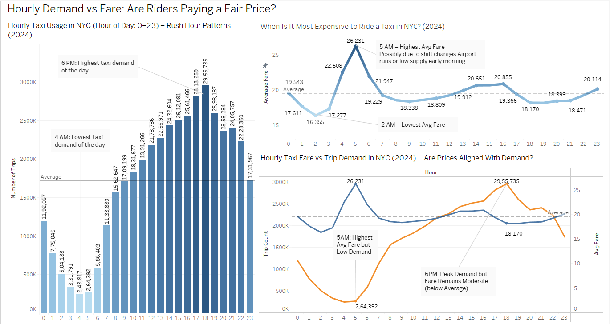
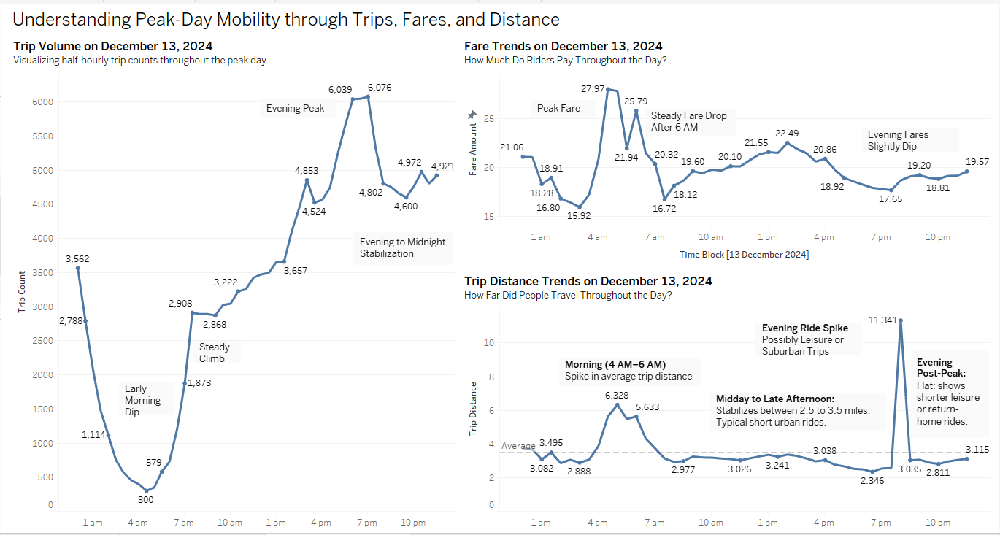
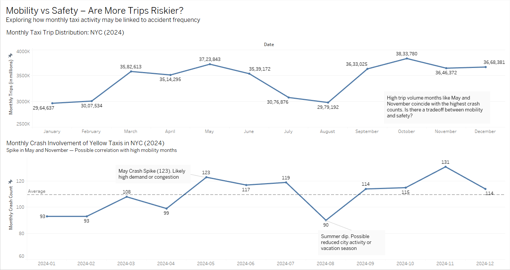

# NYC Taxi Mobility and Safety Trends

This project analyzes New York City yellow taxi activity in 2024 to understand mobility demand, fare behavior, congestion patterns, and safety trends. The project combines taxi trip records, subway ridership, traffic volume, crash records, and driver availability data to build a visual story of how NYC moves.

The analysis uses Python for data preparation and Tableau for dashboard design.

## Project Objective

The goal of this project was to explore how taxi demand, pricing, traffic congestion, and safety patterns interact across New York City.

Key questions explored:

* When and where is taxi demand highest?
* Do fare patterns align with rider demand?
* How do holidays and seasonal patterns affect taxi usage?
* Which boroughs and road segments show the highest mobility pressure?
* Do higher taxi trip volumes relate to more taxi-involved crashes?

## Business Relevance

Taxi operators, fleet managers, city planners, and transportation stakeholders need better visibility into mobility patterns to improve driver deployment, pricing decisions, congestion planning, and safety monitoring.

This project turns large public transportation datasets into practical visual insights for urban mobility decision-making.

## Data Sources

The project used publicly available NYC transportation datasets:

* NYC Yellow Taxi Trip Data
* MTA Subway Ridership Data
* NYC Traffic Volume Counts
* TLC Vehicles Involved in Crashes
* Medallion Active Drivers
* Taxi Zone Lookup Data

Large raw datasets are not included in this repository because of file size. The repository includes processed summary datasets used for analysis and dashboarding.

## Tools Used

* Python
* Pandas
* NumPy
* PyArrow
* Jupyter Notebook
* Tableau
* Excel

## Dashboard Preview

### Dashboard 1: Citywide Mobility Overview

This dashboard gives a broad view of NYC taxi movement in 2024, including daily trip patterns, holiday dips, taxi versus subway trends, borough-level pickups/drop-offs, and congested road segments.

### Dashboard 2: Hourly Demand vs Fare

This dashboard compares hourly taxi demand with average fare patterns to see whether pricing aligns with rider behavior.

### Dashboard 3: December 13 Peak-Day Taxi Behavior

This dashboard zooms into December 13, 2024, a peak taxi activity day, and analyzes trip volume, fare trends, and trip distance throughout the day.

### Dashboard 4: Mobility vs Safety

This dashboard compares monthly taxi trip volume with taxi-involved crash counts to explore the relationship between mobility and safety risk.

## Key Findings

* Taxi demand follows strong daily, weekly, and seasonal patterns.
* Holiday periods create sharp drops in trip volume.
* Manhattan remains the central taxi activity zone in NYC.
* Queens shows a pickup-heavy pattern, likely connected to airport-origin trips.
* Fare patterns do not always match demand peaks.
* Early morning fares are unusually high despite lower trip volume.
* Crash counts appear higher during some high-mobility months.
* Congested road segments such as Cross Bronx Expressway and Long Island Expressway remain major pressure points.

## Repository Contents

* `dashboards/` contains dashboard screenshots.
* `data/processed/` contains processed summary CSV files used for analysis and dashboarding.
* `notebooks/` contains Python notebooks for data conversion, cleaning, combining, and focused analysis.
* `presentation/` contains the final project presentation.
* `reports/` contains the final written report.
* `tableau/` contains the Tableau workbook file.

## Skills Demonstrated

* Large dataset handling
* Parquet to CSV conversion
* Data cleaning and transformation
* Time-series aggregation
* Dashboard design
* Data storytelling
* Business problem framing
* Transportation and urban mobility analysis
* Tableau visualization

## How to Use This Repository

1. Review dashboard screenshots in the `dashboards/` folder.
2. Open processed summary datasets in `data/processed/`.
3. Review notebooks in order:

   * `00_parquet_to_csv_conversion.ipynb`
   * `01_combining_datasets.ipynb`
   * `02_dec13_peak_day_analysis.ipynb`
   * `03_dec13_half_hour_analysis.ipynb`
4. Open the final report in the `reports/` folder.
5. Open the presentation in the `presentation/` folder.

## Future Improvements

* Predictive modeling for crash risk
* Zone-level fare optimization
* Uber and Lyft data integration
* Public Tableau dashboard publishing
* Real-time taxi demand forecasting
